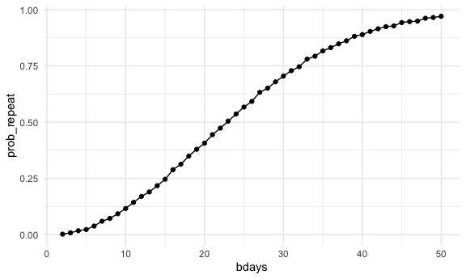
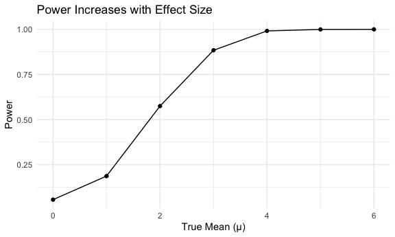
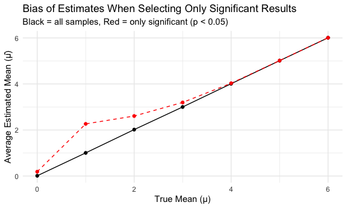
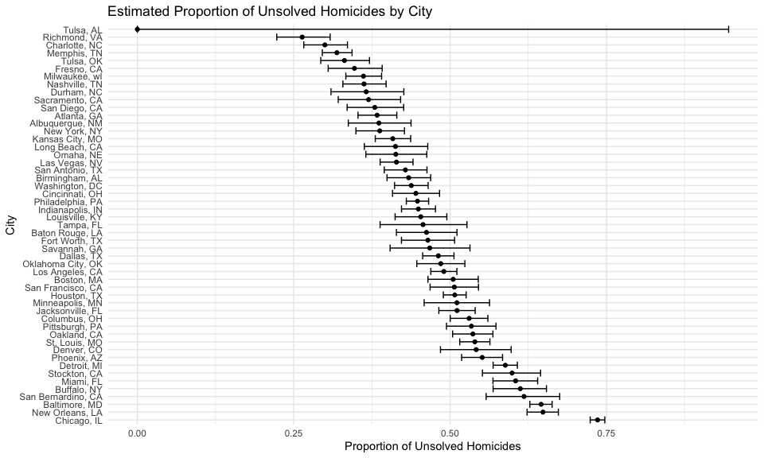

Problem 1

    bday_sim = function(n_room) {
      birthdays = sample(1:365, n_room, replace = TRUE)
      repeated_bday = length(unique(birthdays)) < n_room
      repeated_bday
    }

    bday_sim_results =
      expand_grid(
        bdays = 2:50,
        iter = 1:10000
      ) |> 
      mutate(
        result = map_lgl(bdays, bday_sim)
      ) |> 
      group_by(
        bdays
      ) |> 
      summarize(
        prob_repeat = mean(result)
      )

    bday_sim_results

    ## # A tibble: 49 × 2
    ##    bdays prob_repeat
    ##    <int>       <dbl>
    ##  1     2      0.0024
    ##  2     3      0.0086
    ##  3     4      0.0177
    ##  4     5      0.0231
    ##  5     6      0.0384
    ##  6     7      0.0599
    ##  7     8      0.0724
    ##  8     9      0.093 
    ##  9    10      0.116 
    ## 10    11      0.144 
    ## # ℹ 39 more rows

    bday_sim_results |> 
      ggplot(aes(x = bdays, y = prob_repeat)) +
      geom_point() +
      geom_line()

We can see that the probability of getting a repeat birthday
exponentially increases as the number of students starts to increase,
which makes sense. The probability is almost 0 at 2 students and the
probability is almost 1 at 50 students.

Problem 2

    n = 30
    sigma = 5
    mu = 0:6
    n_sim = 5000
    alpha = 0.05

    results = expand_grid(mu = mu, sim = 1:n_sim) |> 
      mutate(
        data = map(mu, ~rnorm(n, mean = .x, sd = sigma)),
        ttest = map(data, ~ broom::tidy(t.test(.x, mu = 0)))
      ) |> 
      unnest(ttest) |> 
      select(mu, estimate, p.value)

    summary_results = results |> 
      group_by(mu) |> 
      summarize(
        power = mean(p.value < alpha),
        mean_est = mean(estimate),
        mean_est_rejected = mean(estimate[p.value < alpha])
      )

    ggplot(summary_results, aes(x = mu, y = power)) +
      geom_line() +
      geom_point() +
      labs(
        x = "True Mean (μ)",
        y = "Power",
        title = "Power Increases with Effect Size"
      ) 

As the true mean increases, power increases. When the true mean is 0,
the power is around 0.05. When the true mean reaches around 5, the power
is 1.

    summary_results |> 
      ggplot(aes(x = mu)) +
      geom_line(aes(y = mean_est), color = "black") +
      geom_line(aes(y = mean_est_rejected), color = "red", linetype = "dashed") +
      geom_point(aes(y = mean_est), color = "black") +
      geom_point(aes(y = mean_est_rejected), color = "red") +
      labs(
        x = "True Mean (μ)",
        y = "Average Estimated Mean (μ̂)",
        title = "Bias of Estimates When Selecting Only Significant Results",
        subtitle = "Black = all samples, Red = only significant (p < 0.05)"
      ) 

The average estimated mean is are slightly larger than the true mean,
especially as the true mean is less than 3. They start to become more
equal as the true mean increases. This might be because only unusually
large estimates (due to sampling variability) cross the significance
threshold.

Problem 3

    homicide = 
     read_csv("homicide-data.csv", na = c("NA",".", "")) |> 
      janitor :: clean_names() 

    ## Rows: 52179 Columns: 12
    ## ── Column specification ─────────────────────────────────────────────────────────────────────────────────────
    ## Delimiter: ","
    ## chr (9): uid, victim_last, victim_first, victim_race, victim_age, victim_sex, city, state, disposition
    ## dbl (3): reported_date, lat, lon
    ## 
    ## ℹ Use `spec()` to retrieve the full column specification for this data.
    ## ℹ Specify the column types or set `show_col_types = FALSE` to quiet this message.

    homicide

    ## # A tibble: 52,179 × 12
    ##    uid       reported_date victim_last victim_first victim_race victim_age victim_sex city  state   lat   lon
    ##    <chr>             <dbl> <chr>       <chr>        <chr>       <chr>      <chr>      <chr> <chr> <dbl> <dbl>
    ##  1 Alb-0000…      20100504 GARCIA      JUAN         Hispanic    78         Male       Albu… NM     35.1 -107.
    ##  2 Alb-0000…      20100216 MONTOYA     CAMERON      Hispanic    17         Male       Albu… NM     35.1 -107.
    ##  3 Alb-0000…      20100601 SATTERFIELD VIVIANA      White       15         Female     Albu… NM     35.1 -107.
    ##  4 Alb-0000…      20100101 MENDIOLA    CARLOS       Hispanic    32         Male       Albu… NM     35.1 -107.
    ##  5 Alb-0000…      20100102 MULA        VIVIAN       White       72         Female     Albu… NM     35.1 -107.
    ##  6 Alb-0000…      20100126 BOOK        GERALDINE    White       91         Female     Albu… NM     35.2 -107.
    ##  7 Alb-0000…      20100127 MALDONADO   DAVID        Hispanic    52         Male       Albu… NM     35.1 -107.
    ##  8 Alb-0000…      20100127 MALDONADO   CONNIE       Hispanic    52         Female     Albu… NM     35.1 -107.
    ##  9 Alb-0000…      20100130 MARTIN-LEY… GUSTAVO      White       56         Male       Albu… NM     35.1 -107.
    ## 10 Alb-0000…      20100210 HERRERA     ISRAEL       Hispanic    43         Male       Albu… NM     35.1 -107.
    ## # ℹ 52,169 more rows
    ## # ℹ 1 more variable: disposition <chr>

This dataset contains 52,179 rows and 12 columns. This data contains
important information such as the location of the killing, date of the
report, whether an arrest was made and, basic demographic information
about each victim.

    homicide_city_state = 
      homicide |> 
      mutate(
        city_state = paste(city, state, sep = ", ")
      )
    homicide_city_state

    ## # A tibble: 52,179 × 13
    ##    uid       reported_date victim_last victim_first victim_race victim_age victim_sex city  state   lat   lon
    ##    <chr>             <dbl> <chr>       <chr>        <chr>       <chr>      <chr>      <chr> <chr> <dbl> <dbl>
    ##  1 Alb-0000…      20100504 GARCIA      JUAN         Hispanic    78         Male       Albu… NM     35.1 -107.
    ##  2 Alb-0000…      20100216 MONTOYA     CAMERON      Hispanic    17         Male       Albu… NM     35.1 -107.
    ##  3 Alb-0000…      20100601 SATTERFIELD VIVIANA      White       15         Female     Albu… NM     35.1 -107.
    ##  4 Alb-0000…      20100101 MENDIOLA    CARLOS       Hispanic    32         Male       Albu… NM     35.1 -107.
    ##  5 Alb-0000…      20100102 MULA        VIVIAN       White       72         Female     Albu… NM     35.1 -107.
    ##  6 Alb-0000…      20100126 BOOK        GERALDINE    White       91         Female     Albu… NM     35.2 -107.
    ##  7 Alb-0000…      20100127 MALDONADO   DAVID        Hispanic    52         Male       Albu… NM     35.1 -107.
    ##  8 Alb-0000…      20100127 MALDONADO   CONNIE       Hispanic    52         Female     Albu… NM     35.1 -107.
    ##  9 Alb-0000…      20100130 MARTIN-LEY… GUSTAVO      White       56         Male       Albu… NM     35.1 -107.
    ## 10 Alb-0000…      20100210 HERRERA     ISRAEL       Hispanic    43         Male       Albu… NM     35.1 -107.
    ## # ℹ 52,169 more rows
    ## # ℹ 2 more variables: disposition <chr>, city_state <chr>

    city_summary = homicide_city_state |>
      mutate(
        unsolved = disposition %in% c("Closed without arrest", "Open/No arrest")
      ) |> 
      group_by(city_state) |> 
      summarize(
        total = n(),
        unsolved_count = sum(unsolved),
        .groups = "drop"
      )

    city_summary

    ## # A tibble: 51 × 3
    ##    city_state      total unsolved_count
    ##    <chr>           <int>          <int>
    ##  1 Albuquerque, NM   378            146
    ##  2 Atlanta, GA       973            373
    ##  3 Baltimore, MD    2827           1825
    ##  4 Baton Rouge, LA   424            196
    ##  5 Birmingham, AL    800            347
    ##  6 Boston, MA        614            310
    ##  7 Buffalo, NY       521            319
    ##  8 Charlotte, NC     687            206
    ##  9 Chicago, IL      5535           4073
    ## 10 Cincinnati, OH    694            309
    ## # ℹ 41 more rows

    baltimore_test <- 
      city_summary |> 
      filter(city_state == "Baltimore, MD") |>  
      summarize(test = list(prop.test(unsolved_count, total))) |>  
      pull(test) |>
      (\(x) broom::tidy(x[[1]]))() |>
      select(estimate, conf.low, conf.high) 

    baltimore_test

    ## # A tibble: 1 × 3
    ##   estimate conf.low conf.high
    ##      <dbl>    <dbl>     <dbl>
    ## 1    0.646    0.628     0.663

    city_props = city_summary |> 
      mutate(
        prop_test = map2(unsolved_count, total, ~ prop.test(.x, .y) |> 
                           broom :: tidy())
      ) |> 
      unnest(prop_test) |> 
      select(city_state, estimate, conf.low, conf.high)

    ## Warning: There was 1 warning in `mutate()`.
    ## ℹ In argument: `prop_test = map2(unsolved_count, total, ~broom::tidy(prop.test(.x, .y)))`.
    ## Caused by warning in `prop.test()`:
    ## ! Chi-squared approximation may be incorrect

    city_props

    ## # A tibble: 51 × 4
    ##    city_state      estimate conf.low conf.high
    ##    <chr>              <dbl>    <dbl>     <dbl>
    ##  1 Albuquerque, NM    0.386    0.337     0.438
    ##  2 Atlanta, GA        0.383    0.353     0.415
    ##  3 Baltimore, MD      0.646    0.628     0.663
    ##  4 Baton Rouge, LA    0.462    0.414     0.511
    ##  5 Birmingham, AL     0.434    0.399     0.469
    ##  6 Boston, MA         0.505    0.465     0.545
    ##  7 Buffalo, NY        0.612    0.569     0.654
    ##  8 Charlotte, NC      0.300    0.266     0.336
    ##  9 Chicago, IL        0.736    0.724     0.747
    ## 10 Cincinnati, OH     0.445    0.408     0.483
    ## # ℹ 41 more rows

    city_props |> 
      arrange(desc(estimate)) |> 
      mutate(city_state = factor(city_state, levels = city_state)) |> 
      ggplot(aes(x = city_state, y = estimate)) +
      geom_point() +
      geom_errorbar(aes(ymin = conf.low, ymax = conf.high)) +
      coord_flip() +
      labs(
        x = "City",
        y = "Proportion of Unsolved Homicides",
        title = "Estimated Proportion of Unsolved Homicides by City"
      ) 

